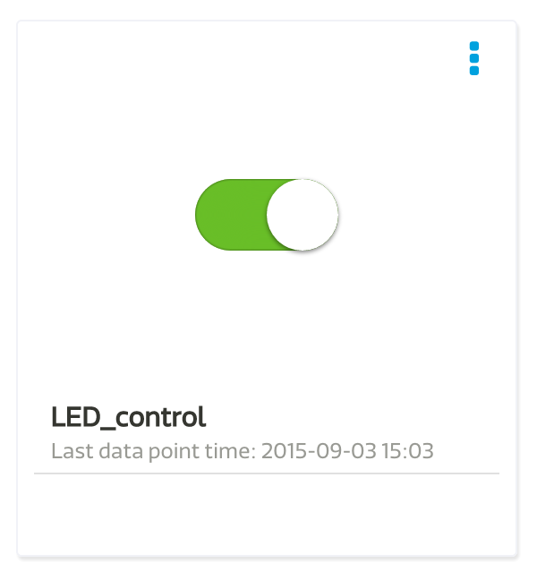

## 使用 MCS + firmata 控制 LED

### 前言

請先使用完畢 [之前的章節](/content/zh-TW/cloud/MCSjs.md)

### 步驟

* 編輯之前章節的 app.js( 把原來的內容清空 )
* :
    ```
        var ledPin = 13;         
        var firmata = require('firmata');     
        var mcs = require('mcsjs');                
        var board = new firmata.Board("/dev/ttyS0", function(err) {                                                                                             
            if (err) {                             
                console.log(err);                          
                board.reset();                             
                return;                         
            }                                                                              console.log('connected...');                                                   console.log('board.firmware: ', board.firmware);   
            board.pinMode(ledPin, board.MODES.OUTPUT);
            var myApp = mcs.register({
                deviceId: 'DLTeF0km',
                deviceKey: 'UfnOy2m7yWw3aTGG',
            });                                                        
            myApp.on('GPIO_00', function(time, data) {
                console.log('blink');
                console.log(data);
                if(data === '1'){
                    board.digitalWrite(ledPin, board.HIGH);                 } else {                                                                           board.digitalWrite(ledPin, board.LOW);
                }
            });                                                                        });   
    ```
* 存檔成功後執行 node app
* 這時候回到 MCS 畫面，按下這個 data channel 的 switch按鈕。 
    
    
* 在切回 command line ，你就會看到
    ```
        blink!
    ```
* 完成這以上步驟即代表你的 l7688 已成功跟 MCS 完成對話串接。

### 下個章節我們來實作如何透過 MCS <-> l 7688 <-> LED (藉由 firmata 套件) 來實際控制真實的 LED 燈。